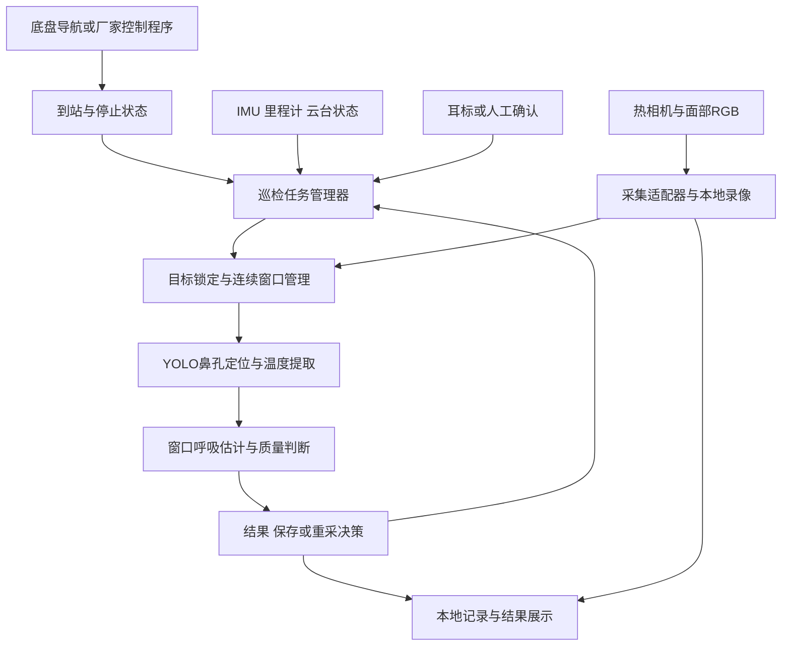

# 巡检小车奶牛呼吸检测与科研采集实施方案

日期：2026-09-07。状态：接入设计，尚未连接设备、修改底盘控制程序或验证车载性能。

用户已确认：小车已有导航，使用ROS 2；热相机沿用原文的FLIR ONE Edge Pro；车载电脑尚未到货。ROS 2发行版、是否采用Nav2、具体话题与动作接口、手机平台及SDK可用性仍需核实。电脑到货前先准备采集链路和回放流程，不预设CPU/GPU或操作系统。

对应的[ROS 2与FLIR接入细化方案](rr_robot_ros2_flir_edge_pro_integration_20260907.md)列出了建议接口、数据时间轴及联调验收条件。

## 1. 首版任务与工作方式

首版采用定点停车测量：到达预定观测位置，确认车体和相机稳定，关联目标牛，采集连续热红外窗口，输出呼吸率或不可判定，保存资料后继续巡检。

小车行驶期间可录制数据用于研究，首版有效呼吸窗口从停车稳定后开始。移动成像会增加相机位姿变化、机械振动、尺度变化和目标切换；历史离线结果不足以证明移动计数可靠。

| 模式 | 单次观测建议 | 用途 | 输出 |
|---|---|---|---|
| 日常巡检 | 停稳后30至60秒连续窗口 | 提高巡检效率 | 每窗RR、状态、时间、牛号与证据位置 |
| 科研采集 | 停稳后连续2至3分钟，并保留到站与离站上下文 | 比较窗口长度、运动、丢失与平台效应 | 原始热视频、参考RGB、机器人日志和标注资料 |
| 移动采集实验 | 保留速度、姿态和连续画面 | 研究移动影响 | 标为实验输入，不自动纳入首版有效测量 |

这些时长及下述等待、重试设置均为试采建议，尚不是经过验证的部署阈值。RR是一个时间窗内的估计；即使逐帧检测很快，也需要积累相应长度的观测。

## 2. 原文与本项目定位

Chen等2025年论文第3.6节已经提出巡检机器人方案，包括热相机安装、约1米工作距离和每牛约3分钟拍摄，但该节表述的是未来应用设想。原文中60厘米安装高度不能直接代替当前牛舍鼻部高度的测量。

因此，仅安装相机上车不构成新的算法贡献。可验证的贡献应来自停车稳定判定、观测质量与任务重试、实际牛号绑定、现场拒判策略，以及精度与巡检吞吐率的权衡。

## 3. 硬件和安装

| 部件 | 首版选择原则 | 接口与注意事项 |
|---|---|---|
| 已有小车底盘 | 保留厂家导航、避障和人工接管能力 | 提供到站、停止确认、故障和速度状态；检测模块不接管底层制动 |
| 面部热相机 | 优先能稳定读取原始帧、时间戳和逐像素测温数据 | 核实SDK支持的设备与操作系统；网络视频不自动等于测温流 |
| 可见光相机 | 面部与耳标识别、目标关联 | 车头相机通常看不到清楚侧腹，不能自动充当计数真值 |
| 车载计算机 | 先用已有笔记本/工控机验证，再按实测负载选嵌入式计算机 | 同时测录制、解码、YOLO、测温和导航负载；不只看模型推理速度 |
| 可调支架 | 相机朝向目标鼻部，支持高度和俯仰调整 | 刚性可靠固定与适当减振；第一阶段可以人工调整 |
| 云台（可选） | 用于到站后重新构图 | 计数窗口内尽量保持姿态；云台动作后重新稳定并开始窗口 |
| IMU和里程计 | 优先读取小车已有传感器 | 带时间戳记录角速度、加速度、轮速和位姿；车体与相机分别考虑 |
| 本地SSD | 持续录制与断网缓存 | 采集前检查可用空间；容量按实际码率和测温矩阵大小估算 |
| 温湿度记录器 | 收集现场工况 | 远离计算机散热口、电机和电池热源，记录安装位置 |
| 供电和防护 | 按设备铭牌设计稳压、电流余量和关机策略 | 不直接假设电机电源适合相机/电脑；急停、避障独立于RR任务 |

安装细节：

- 相机首先朝向喂料通道一侧的牛鼻部，而不必朝小车前进方向；避免栏杆遮住关键ROI。
- 约1米可作构图试验起点，最终距离由安全通行条件、镜头和鼻孔热像素尺度决定。
- 记录相机到鼻部的距离和支架姿态；升降支架注意重心、通道净空和防碰撞。
- 热相机镜头前不能随意装普通玻璃或普通透明塑料防护罩。需要保护窗时核实长波红外透过率，并评估测温补偿。[3]
- 镜头避开喷淋、泥水和直接日照干扰；机箱散热气流不要朝牛鼻部吹。
- 小车到站命令成功不等于相机已经稳定。记录残余振动、云台动作和地面坡度造成的移动。

### 使用现有手机式热相机时

本次沿用FLIR ONE Edge Pro。先验证设备通过官方App或相应SDK获取帧和温度的实际能力。官方提供移动端开发工具，但这不等于该相机可直接被Windows/Linux上的OpenCV或ROS读取。[2]

可行的验证顺序为：官方App保存与导出检查；确认SDK的型号、平台、数据格式和持续采集支持；优先验证手机采集端向车载机传输带时间戳数据的方案。在此之前，可以先完成上车录像和离线分析。不能把普通MP4或屏幕录制当作逐像素测温原始数据，也不预先承诺实机SDK的实时测温能力。

## 4. 软件结构



上述模块是建议职责划分，不代表仓库中已经存在这些服务。先通过本地进程和明确输入输出对接即可，无需先建立复杂云平台。

底盘已使用ROS 2，但尚未确认导航是否为Nav2。如果为Nav2，可使用航点到达后的任务执行机制接入采集任务；Nav2官方提供航点任务插件，支持等待、拍照等到站动作。[1] 应根据小车实际ROS发行版使用对应接口，不能把rolling文档的配置直接假定适用。

如果小车采用厂家控制软件，只要能够提供到站/停车状态及继续任务接口，同样可以接入。离线人工遥控停车也可以作为第一阶段，不必为验证RR而重写导航。

## 5. 一次访问的状态流程

| 状态 | 动作和转移条件 |
|---|---|
| NAVIGATING | 前往观测点，允许背景录制，不启动首版有效计数窗口 |
| STOPPING | 请求停止并检查底盘反馈；安全系统始终保有控制权 |
| SETTLING | 等待约3至5秒作为试采起点，同时确认速度、振动和画面稳定 |
| TARGET_LOCK | 选择一头牛，核对身份、距离和鼻孔可观测性；排除目标频繁切换 |
| OBSERVING | 按实际采集时钟累计同一目标的连续30或60秒窗口 |
| ESTIMATING | 输出RR和窗口质量；解释失败原因，不把质量评分称为校准概率 |
| RECORDING_RESULT | 原始文件和元数据写入完成后，记录结果与证据路径 |
| RETRY_OR_NEXT | 数据不足时至多重试预设次数或达到最大驻留时间，然后跳过或继续 |
| FAULT_OR_ABORT | 急停、通信故障、空间不足等使访问结束或暂停，并记录原因 |

首版可先设置一次重试，最大驻留时间由模式和现场运行要求确定，在试采后冻结。30秒初值与60秒估计应各自保存时间窗，不能把后者默认称为已验证更准确的值。

窗口连续性规则：

1. 牛只目标发生切换时立即结束当前窗口并重置，不拼接不同个体信号。
2. 小车或云台明显移动时，原始录像继续保存，计数窗口按预定规则中止并重新稳定。
3. 单侧丢失但另一侧可信时可继续；双侧长时间不可见时保留缺失证据并请求新窗口。
4. 短缺口是否修复沿用待验证的时间、位移和观测约束；不能仅因追踪器仍有坐标便当作真实可见温度。
5. 不把多个不连续片段拼成30秒完整观测后数峰。若另行研究分段估计，需要独立定义估计量和对应参考。
6. 帧掉落、重复帧、相机校正和时间戳不连续分别记录；设备断流后启动新序列。
7. 用实际窗口起止时刻换算RR，不用图像缩短、移动平均valid输出长度或推理帧数冒充真实时长。

这里的观测准入/重采与历史试验中的逐帧质量掩码不是同一个模块。新准入策略需要同时评价误差和覆盖率，不能因为跳过困难视频而只展示更高准确率。

## 6. 现有算法需要的适配

当前`scripts/paper_repro_rr.py`是文件夹批处理工具。可复用其定位、ROI温度提取和曲线函数，但整个命令行程序还不是车载流式服务。

| 项目 | 当前检查到的情况 | 接入要求 |
|---|---|---|
| 输入 | 按视频图像文件夹和缓存温度表运行 | 增加相机/文件回放适配器，统一帧ID、采集时间和格式 |
| 模型 | 配置指定YOLO及随机森林 | 启动时加载并记录校验值，不能逐帧重新加载 |
| 时间 | 默认fps=8.7，可从truth CSV取得时长 | 车载侧直接传入真实窗口起止时间和帧时间戳 |
| 计数规则 | 存在针对旧数据的dense_peak_target=10等分支 | 单独审查和冻结部署规则；不能凭旧计数目标改新牛计数 |
| 温度 | 旧随机森林训练的BGR语义 | 固定训练/推理通道顺序；换设备或渲染方式重新检查映射 |
| ROI | 固定20输出像素的历史参照 | 新分辨率和构图先验证其对应范围；不直接假设自适应ROI有效 |
| 真值工具 | 具有优化、真值辅助校准与评估功能 | 现场推理不读取人工计数；参考与离线评分单独保存 |
| 缺失处理 | 脚本存在插值和多种推断路径 | 部署适配器显式控制长缺失、外推和跨目标连续性 |
| 输出 | CSV、曲线、汇总结果 | 增加session结果消息、状态码和证据链接 |
| 性能 | 既有离线结果不代表车载时延 | 同时测试采集、存盘、解码、检测、温度映射和导航 |

固定窗口内可边采集边提取温度，采满后完成融合和计数。整窗归一化和使用后续帧的平滑应解释为窗口完成后的计算，不能将离线结果表述为逐帧零延迟输出。

若推理速度不足，优先本地完整录制并异步处理，输出时标记测量时刻与当前结果年龄。任何帧降采样必须保留时间轴并重新验证计数。ONNX/TensorRT等加速需根据实际硬件选择，并检查转换前后关键点和RR一致性。

## 7. 个体身份和结果接口

停车点编号、喂料槽编号和视频序号都不是可靠的真实牛号。牛会换位；视觉跟踪ID在遮挡后也可能变化。

首版可由现场人员核对耳标后登记，后续再接耳标识别或RFID。RFID也需要处理相邻多标签和读取区域对应，不能把读到的第一个标签直接绑定给画面里的牛。

建议结果至少包含：

| 字段 | 含义 |
|---|---|
| visit_id / session_id / window_id | 巡检访问、一次采集和测量窗口 |
| farm_id / cow_id | 真实身份；未确认的cow_id为空 |
| track_id / identity_status | 临时视觉目标和身份状态，分开存储 |
| window_start / window_end / duration_seconds | 实际观测时刻与时长 |
| measurement_status | measured、insufficient_signal、camera_error等；与身份状态分开 |
| rr_bpm / breath_count | RR和事件次数；不可判定时为空，不填0 |
| quality_flags / coverage / longest_gap_seconds | 可解释的质量与缺失信息 |
| estimator_version / camera_config_id | 模型与设备配置追溯 |
| source_paths / peaks_path | 原始资料与事件证据 |

信号可测但牛号不明时，可保留匿名会话估计供研究，不能写入已知牛的健康档案。低质量、无结果和无牛目标也保留访问记录，作为巡检成功率分母。

## 8. 顺便采集的数据如何变成研究数据

建议在规定时段、规定路线和预定牛只上保留全部访问记录，不只保存算法成功或曲线漂亮的视频。

每次访问保留：

- 原始热流/测温数据和面部RGB，设备源时间戳与接收时间；两个时间含义分开。
- 到站、停车、开始观察、重采、结束和离站的状态事件。
- IMU、里程计、云台角度及动作、相机配置和校正事件。
- 真实牛号、人工确认方式、现场温湿度、风扇和喷淋状态。
- 算法帧级ROI位置、温度、信号来源、峰位置和窗口结果。
- 科研采集时的同步侧腹参考和人工计数版本。

前方车载RGB往往无法看见侧腹。科研阶段可安排第二人用手机从侧方录像，或使用固定侧腹参考机位/合适的同步传感器。单人采集时，先在固定参考机位覆盖的少量牛上验证，不能默认车头RGB具有独立真值。

两路时钟在采集前后核对同步；若没有硬件同步，使用热/RGB都可识别的事件并记录偏移和漂移。完整双人标注暂不作为首版前提，但计数者应不看算法输出；不确定计数保留区间和原因。

建议的资料目录是未来落盘约定，当前尚未创建数据集：

```text
Dataset_robot/<farm_id>/<date>/<visit_id>/
    raw_thermal/
    face_rgb.mp4
    reference_flank.mp4
    frame_timestamps.csv
    robot_motion.csv
    camera_settings.json
    visit_events.jsonl
    metadata.json
    predictions.jsonl
    annotation/
```

无侧腹参考时不创建假的参考文件。未知元数据留空。保存模型输出不应污染标注界面；人工参考可在独立目录和随机编号界面中完成。

沿用[已有现场采集方案](rr_fieldwork_plan_20260907.md)中的场次、窗口、事件表，新增[小车访问记录表](rr_robot_visit_log_template_20260907.csv)关联robot_run_id、visit_id与session_id。停止或失败访问即使没有形成完整session也保留。

## 9. 从搭建到验证的四步

| 步骤 | 要做的事 | 验收依据 |
|---|---|---|
| 台架回放 | 现有电脑跑保存视频，验证相机SDK与文件保存 | 格式、时间、模型加载和输出可追溯；无真值依赖 |
| 人工停车采集 | 上车固定支架，人工遥控到位、登记牛号 | 与同步参考比较，检查上车振动和热背景影响 |
| 到站自动测量 | 对接厂家接口或ROS 2任务，加入重试与状态输出 | 断流、目标切换和身份未知时正确结束；不阻塞底盘安全控制 |
| 冻结路线测试 | 在新牛/新日期执行整条路线 | RR误差、覆盖率、牛号正确率、每小时有效牛数和故障恢复 |

首轮可用10至20头牛验证安装和流程，之后按现场采集方案扩展。这个数量是工程试验起点，不是统计充分性保证。

建议对照条件包括三脚架固定、车载停车电源开启、停车稳态触发，以及只用于研究的低速移动。不同条件下每段各自配同步参考；不要假定同一头牛隔几分钟呼吸率完全相同。可以交替或随机化条件顺序减小时段影响。

移动车载相较三脚架表现下降时，先判断振动、温度映射、机位尺度、时间戳或牛号问题，再选择跟踪补偿算法。历史CoTracker/TFA等试验不能替代当前平台实验。

## 10. 巡检效率与论文指标

访问耗时约为行驶+定位/稳定+采集+重试/额外处理。模型推理FPS只能描述其中一部分。

例如行驶10秒、稳定5秒、采集30秒且处理已重叠完成，理想为3600/45=80次访问/小时；采集60秒则约48次访问/小时。避障、牛离开、重采和充电会降低实际结果；这些数字不是设备性能承诺。重复访问还需要按真实牛号去重。

应报告：

- 在参考可读且有输出的窗口上：R²、MAE、RMSE、完全计数正确率及事件误检/漏检。
- 在所有预定且有牛访问中：测量输出覆盖率、身份确认率、超时/重试/跳过比例。
- 整个巡检任务：每小时身份确认且有有效RR的不同牛数、端到端时延、单位有效测量能耗、数据完整率。
- 按运动、遮挡、距离、牧场和日期分层，并用牛只/场次结构计算不确定性。
- 采集成功率、身份正确率和参考可读率分开报告；高准确率但大量无输出不是同样的部署能力。

已调试过的巡检数据归开发。所有同牛、同长视频和重叠窗口留在同一分组，最后用未参与调参的新牛/日期/牧场做冻结测试。

单次RR读数及暂定阈值只能生成需要复核的提醒；热应激或疾病判定还需要可靠生理/环境参考。屏幕应明确显示观测时刻、质量和是否需要重测，避免把过期值当实时结果。

## 11. 已确认与后续核实的信息

1. 已有ROS 2导航：后续核实发行版、是否Nav2，以及到站/停止/继续/故障接口，不重做导航。
2. FLIR ONE Edge Pro：后续核实手机系统、App/固件版本、可导出格式和SDK持续采集能力。
3. 车载电脑等待到货：届时读取CPU/GPU、操作系统、存储和供电信息，再确定部署方式；现在可在已有电脑准备回放。

确认后再选择具体采集适配器、通信接口和计算部署方式。当前文档完成的是可审阅方案，不宣称车载功能已经实现。

## 参考

[1] Nav2官方Waypoint Follower文档：https://docs.nav2.org/rolling/configuration_and_development/configuration_guide/core_servers/waypoint_follower/ 。证明可接到站任务；具体配置需与实际ROS发行版对应。

[2] FLIR Mobile SDK：https://www.flir.com/en-eu/developer/mobile-sdk/ ；FLIR Edge Pro产品说明：https://www.flir.com/en-ca/products/flir-one-edge-pro/ 。具体设备和平台接口仍需实机验证。

[3] FLIR OEM保护窗说明：https://oem.flir.com/support/support-center/knowledge-base/for-protection-is-a-special-window-needed-in-front-of-my-flir-camera-that-wont-interfere-with-the-thermal-imaging/ ；普通玻璃影响说明：https://www.flir.com/en-gb/discover/home-outdoor/can-thermal-imaging-see-through-walls/ 。

[4] Chen等，2025，Respiratory rate detection of dairy cows based on infrared thermography in head movement scenarios，DOI:10.1016/j.jtherbio.2025.104154，第3.6节；本地PDF：E:/real/可能结合文献/1-s2.0-S0306456525001111-main.pdf。
