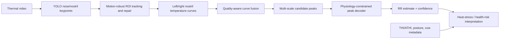

# 奶牛热红外呼吸频率创新研究方案

更新日期：2026-07-04

## 1. 当前复现基线

当前可复现实验已经具备投稿前的基线能力，但还不足以直接作为高分区论文的主要创新。

数据集：`Dataset_new/72video/al_images`，共 73 个视频。

当前默认流程指标来自 `Dataset_new/72video/al_images/paper_repro_metrics.csv`：

| 指标 | 当前默认流程 |
|---|---:|
| RR R2, identity line | 0.928992 |
| RR Pearson R2 | 0.932707 |
| RR MAE | 1.9713 bpm |
| RR RMSE | 3.3950 bpm |
| 精确呼吸次数 | 49/73 |
| within +/-1 breath | 73/73 |
| abs_count_error >= 2 | 0 |

`paper_repro_truth_calibrated_metrics.csv` 中 truth-calibrated R2 为 0.999655，精确计数 73/73。这个结果只能作为“真值辅助后验上限”，不能作为论文主性能，因为它使用了测试视频真值信息做逐视频校准。

当前剩余问题：默认流程仍有 24 个视频存在 +/-1 次呼吸误差。要进一步提高精度，需要从“峰值检测规则”升级为“运动鲁棒、质量感知、生理约束的呼吸信号解码”。

已生成误差分类文件：

- `Dataset_new/72video/al_images/paper_repro_error_taxonomy.csv`
- `Dataset_new/72video/al_images/paper_repro_error_taxonomy_summary.csv`

当前 24 个剩余错误的自动初分如下：

| 错误类型 | 视频数 |
|---|---:|
| endpoint_or_boundary_missing_peak | 10 |
| boundary_extra_peak_or_window_mismatch | 5 |
| noise_or_double_peak_overcount | 5 |
| overcount_periodicity_ambiguous | 2 |
| single_channel_or_fusion_missing_peak | 1 |
| weak_noise_peak_overcount | 1 |

这说明最优先的算法创新应集中在端点/边界峰、短间隔噪声峰和窗口一致性，而不是继续做温度映射本身。

## 2. 本地与联网文献地图

### 2.1 热红外鼻孔路线

本地 PDF `agriculture-13-01939-v2.pdf`：

- 题名：Detection of Respiratory Rate of Dairy Cows Based on Infrared Thermography and Deep Learning
- DOI：https://doi.org/10.3390/agriculture13101939
- 方法：YOLOv8 检测鼻部，Mask2Former/Mask R-CNN/SOLOv2 分割鼻孔，基于鼻孔温度曲线滑窗检测峰值。
- 报告结果：鼻部检测 AP50 98.6%，鼻孔分割 AP50 75.71%，呼吸频率准确率 94.58%，相关系数 R=0.95。

联网 Crossref 检索到 2025 年更贴近本课题的新方向：

- 题名：Respiratory rate detection of dairy cows based on infrared thermography in head movement scenarios
- 期刊：Journal of Thermal Biology, 2025
- DOI：https://doi.org/10.1016/j.jtherbio.2025.104154
- 启示：头部运动场景是热红外鼻孔呼吸监测的最新痛点。当前项目正好有 YOLO 关键点、缺失修复、温度曲线和峰值误差诊断，可以围绕“head movement robustness”做创新。

### 2.2 RGB/端到端视频路线

本地 PDF `1-s2.0-S0022030224010300-main.pdf`：

- 题名：Learning end-to-end respiratory rate prediction of dairy cows from red, green, and blue videos
- DOI：https://doi.org/10.3168/jds.2023-24601
- 方法：VideoMAE 端到端从 RGB 视频预测 RR，减少 ROI 检测、跟踪等多模块误差传播。
- 本地摘要片段显示其报告 MAE 2.58 bpm，RMSE 3.52 bpm，Pearson r 0.86。
- 启示：端到端时序模型是强竞争方向，但它依赖更多视频和标注。当前 73 个热红外视频更适合做“生理约束 + 弱监督/自监督”而不是直接训练大型 Transformer。

### 2.3 图像分析 + FFT 路线

本地 PDF `1-s2.0-S2666910223001217-main.pdf`：

- 题名：Predicting respiration rate in unrestrained dairy cows using image analysis and fast Fourier transform
- DOI：https://doi.org/10.3168/jdsc.2023-0442
- 方法：从非约束卧躺奶牛图像中用图像分析和 FFT 提取 RR。
- 启示：FFT 可作为独立基线或辅助质量指标，但在当前热红外鼻孔曲线上单独替代峰值检测效果不稳定。更适合用于候选峰的周期一致性约束。

### 2.4 环境与解释性机器学习路线

本地 PDF `1-s2.0-S1537511024000163-main.pdf`：

- 题名：A comparative study of machine learning models for respiration rate prediction in dairy cows: Exploring algorithms, feature engineering, and model interpretation
- DOI：https://doi.org/10.1016/j.biosystemseng.2024.01.010
- 方法：环境、个体、姿态等特征工程 + 多种机器学习模型 + SHAP 解释。
- 启示：单纯 RR 测量是工程指标，结合 ATHI/THI、姿态、泌乳天数、产奶量等解释热应激风险，论文意义会更强。

本地中文 PDF `基于超参数优化算法的随机森林模型预测奶牛呼吸频率.pdf`：

- DOI：10.11975/j.issn.1002-6819.202401090
- 方法：ATHI、时间区域、产奶量、泌乳天数、姿势、胎次等输入，BO-RF 综合性能最优。
- 启示：环境热应激解释是国内外均认可的应用价值。热红外视频 RR 可作为更直接的生理测量，与环境模型互补。

### 2.5 数据集、泛化与多摄像头路线

联网文献显示 PLF 视觉研究的关键瓶颈是公开数据、跨场景泛化、身份追踪和多摄像头：

- Public Computer Vision Datasets for Precision Livestock Farming: A Systematic Survey 指出高质量、多环境、带上下文元数据的公开 livestock CV 数据仍然不足，且 cattle 数据占比较高但任务集中在检测/识别。链接：https://arxiv.org/abs/2406.10628
- Systematic Literature Review of Vision-Based Approaches to Outdoor Livestock Monitoring 提出户外/真实场景中视觉管线在检测、跟踪、场景变化、遮挡等阶段仍有挑战。链接：https://arxiv.org/abs/2410.05041
- MultiCamCows2024 展示了多摄像头、自监督、个体重识别在真实奶牛场中的可行性，单图识别准确率超过 96%，并强调多摄像头和自监督可减少人工标注。链接：https://arxiv.org/abs/2410.12695

## 3. 推荐主创新点

### 3.0 概念框架



### 主线题目建议

中文题目：

面向头部运动场景的奶牛热红外呼吸频率鲁棒监测：质量感知鼻孔温度融合与生理约束峰值解码

英文题目：

Motion-Robust Infrared Thermography for Dairy Cow Respiratory Rate Monitoring Using Quality-Aware Nostril Temperature Fusion and Physiology-Constrained Peak Decoding

### 核心科学/工程问题

现有热红外路线通常把问题拆成鼻部/鼻孔检测、温度映射、滤波、峰值计数。每个模块的小误差都会传递到最终 RR，尤其在头部运动、鼻孔缺失、端点峰、弱峰和噪声峰情况下，容易产生 +/-1 次呼吸误差。当前复现结果也证明：所有错误都已压到 +/-1，但最后这一步很难靠固定阈值继续提升。

### 具体创新点

1. 运动鲁棒鼻孔温度序列构建

现有方法通常只检测每帧鼻孔或鼻部 ROI。本研究可引入关键点轨迹平滑、短时遮挡修复、低置信度坐标回收、左右鼻孔相对位移约束和全局 offset fallback，形成连续温度曲线。当前代码已经有 tracking、opposite nostril inference、global offset、low-confidence fallback，可整理为方法学贡献。

2. 质量感知左右鼻孔融合

不是固定取左/右/均值/最大值，而是计算每条候选曲线的质量分数：缺失率、温度幅值、候选峰数量、峰显著性、峰间隔变异系数、ROI 置信度等。用质量分数选择或加权融合左右鼻孔曲线，降低单侧漏检或热噪声影响。

3. 生理约束峰值解码

把峰值检测从 `find_peaks` 阈值问题改成“候选峰序列解码”问题。候选峰由多尺度平滑、多 prominence、多 distance 产生，再用生理先验筛选：

- RR 合理范围，例如 30-100 bpm，按场景调整。
- 峰间隔不应剧烈跳变。
- 端点峰可补全，但必须满足曲线 relief 和周期一致性。
- 孤立弱峰可删除，但不能破坏整体周期。
- FFT/ACF 只作为周期一致性证据，不直接替代峰值计数。

这可以直接瞄准当前剩余的 +/-1 错误。

4. 不确定性输出与人工复核队列

输出每个视频的 RR 置信度和 error risk。对于低置信度曲线，系统不强行给确定结果，而是标记人工复核。这比只报告平均精度更适合真实牧场部署，也更容易体现应用意义。

5. RR 到热应激/健康风险解释

将 RR 与 THI/ATHI、环境温湿度、姿势、时间段等上下文融合，构建热应激风险评估或异常筛查模型。用 SHAP 或特征重要性解释 RR、环境、姿态对风险的贡献。这样论文不只是“检测呼吸频率”，而是“呼吸频率驱动的福利/热应激监测”。

## 4. 可落地实验路线

### Phase 1：把现有 73 视频做成强基线

目标：在不使用 truth-calibrated 泄漏的前提下，把默认流程稳定到可发表基线。

当前已经完成：

- RR R2 = 0.928992
- Pearson R2 = 0.932707
- MAE = 1.9713 bpm
- RMSE = 3.3950 bpm
- 精确计数 = 49/73
- within +/-1 = 73/73

下一步需要补充：

- 对剩余 24 个错误视频做错误类型标注：端点漏峰、弱峰漏检、局部噪声多峰、左右鼻孔单侧异常、头部运动/ROI 漂移。
- 将错误类型写入一个 `paper_repro_error_taxonomy.csv`。
- 给每类错误对应一个非真值规则，而不是逐视频调参。

### Phase 2：实现生理约束峰值解码器

建议新增模块：`scripts/physiology_peak_decoder.py` 或并入 `paper_repro_rr.py`。

输入：

- `fused_norm`
- `smoothed_norm`
- 左/右鼻孔温度
- 检测置信度、source 标记
- 候选峰集合

输出：

- `decoded_peaks`
- `rr_bpm`
- `rr_confidence`
- `decoder_rule`
- `quality_flags`

候选算法：

1. 多尺度候选峰生成：smooth window = 1, 3, 5；prominence = 0.002 到 0.2；distance = 3 到 10。
2. 周期候选估计：由默认峰间隔、FFT、ACF 给出候选周期范围。
3. 动态规划筛选峰序列：最大化峰显著性与周期一致性，惩罚过短间隔、过长间隔、端点假峰。
4. 置信度估计：峰间隔 CV、最小 prominence ratio、左右鼻孔一致性、温度幅值、缺失比例。

期望目标：

- 默认 RR R2 >= 0.94
- MAE < 1.7 bpm
- 精确计数 >= 58/73
- 保持 within +/-1 = 73/73

### Phase 3：加入热应激/健康解释

如果当前数据没有环境变量，至少可以先设计并预留接口：

- `ambient_temperature`
- `relative_humidity`
- `THI`
- `ATHI`
- `posture`
- `time_period`
- `cow_id`
- `milk_yield`
- `days_in_milk`
- `parity`

如果能补采或整理这些变量，论文意义明显提高。题目可从“RR detection”升级为“thermal stress monitoring”。

推荐模型：

- BO-RF / LightGBM / XGBoost 预测热应激或 RR residual correction。
- SHAP 解释环境和 RR 的贡献。
- 视频 RR 作为核心生理特征，环境变量作为上下文特征。

### Phase 4：泛化验证

仅 73 个视频容易被审稿人质疑数据量小。至少需要以下验证之一：

- leave-one-video-out cross-validation。
- 按牛只/日期/场景分组交叉验证，如果有 cow_id。
- bootstrap 95% CI。
- 新采 20-50 个头部运动更明显的视频作为外部测试集。
- 与当前论文方法、FFT 方法、固定峰值方法、truth-calibrated 上限做对照。

## 5. 论文实验表格建议

### Table 1：方法对比

| 方法 | RR R2 | Pearson R2 | MAE | RMSE | exact count | within +/-1 |
|---|---:|---:|---:|---:|---:|---:|
| 固定峰值检测 | 待跑 | 待跑 | 待跑 | 待跑 | 待跑 | 待跑 |
| 当前默认复现流程 | 0.928992 | 0.932707 | 1.9713 | 3.3950 | 49/73 | 73/73 |
| 生理约束峰值解码器 | 目标 >=0.94 | 目标 >=0.94 | 目标 <1.7 | 目标 <3.0 | 目标 >=58/73 | 73/73 |
| truth-calibrated 上限 | 0.999655 | 0.999723 | 0.1389 | 0.2366 | 73/73 | 73/73 |

注意：truth-calibrated 只能放在消融/上限分析，不能作为主方法性能。

### Table 2：错误类型消融

| 错误类型 | 视频数 | 当前默认错误 | 解码器修正数 | 主要规则 |
|---|---:|---:|---:|---|
| 端点漏峰 | 待标注 | 待统计 | 待统计 | endpoint completion |
| 弱峰漏检 | 待标注 | 待统计 | 待统计 | weak peak recovery |
| 噪声多峰 | 待标注 | 待统计 | 待统计 | short-interval pruning |
| 单侧鼻孔异常 | 待标注 | 待统计 | 待统计 | quality-aware fusion |
| 头部运动 ROI 漂移 | 待标注 | 待统计 | 待统计 | keypoint tracking |

### Figure 建议

1. 方法流程图：thermal video -> YOLO keypoints -> nostril temperature mapping -> quality-aware fusion -> physiology-constrained decoder -> RR + confidence + heat-stress interpretation。
2. 典型错误修正图：展示一个端点漏峰、一个弱峰漏检、一个噪声多峰案例。
3. Bland-Altman 图和 predicted-vs-reference RR 散点图。
4. SHAP/feature importance 图，如果补充环境变量。

## 6. 投稿定位

候选期刊需以投稿当年中科院/JCR 分区为准重新核验。按主题匹配度，优先考虑：

1. Computers and Electronics in Agriculture
   - 适合：计算机视觉、PLF、算法创新、工程部署。
   - 要求：方法创新和泛化验证要强。

2. Biosystems Engineering
   - 适合：工程系统、模型解释、农业生物系统。
   - 要求：实验设计和误差分析要严谨。

3. Journal of Thermal Biology
   - 适合：热红外、生理热调节、热应激。
   - 要求：热应激/生理意义要讲清楚。

4. Journal of Dairy Science / JDS Communications
   - 适合：奶牛健康福利、实际应用。
   - 要求：动物科学问题和数据采集设计要充分。

5. Smart Agricultural Technology / Agriculture
   - 适合：智慧农业系统和应用型方法。
   - 可作为稳妥备选。

## 7. 最推荐的下一步实现任务

按性价比排序：

1. 新增 `paper_repro_error_taxonomy.csv`
   - 人工/半自动给剩余错误视频打标签。
   - 这是后续创新规则和论文误差分析的依据。

2. 实现 `physiology_peak_decoder`
   - 先做规则版动态规划，不急着上深度学习。
   - 直接目标是把 exact count 从 49/73 提高到 58/73 以上。

3. 增加质量置信度输出
   - 每个视频输出 `curve_quality_score`、`rr_confidence`、`review_required`。
   - 这能增加真实应用价值。

4. 设计环境变量表
   - 如果能补到 THI/ATHI、姿势、牛只信息，论文主线可升级为热应激/健康监测。

5. 做外部小测试集
   - 额外采集头部运动明显、遮挡明显的视频。
   - 这是冲二区以上最有说服力的证据。

## 8. 结论

最可行、最有投稿潜力的创新不是重做一个大模型，而是在已有热红外鼻孔路线基础上，提出“头部运动鲁棒 + 质量感知融合 + 生理约束峰值解码 + 不确定性复核”的完整系统。它能直接针对当前剩余 +/-1 错误，也能与 2025 年头部运动场景热红外论文形成明确对话。

如果能补充环境变量和少量外部测试视频，则论文可以从算法复现提升为面向奶牛热应激和健康福利的智能监测系统，更适合冲击二区以上期刊。

## 9. 2026-07-04 可复现实验更新：质量感知残差校正候选

已新增脚本：

- `scripts/rr_quality_residual_corrector.py`

该脚本不覆盖默认流程，而是在 `paper_repro_summary.csv` 和每个视频的 `paper_repro_curve.csv` 基础上，提取曲线质量、峰间隔、端点间隔、峰显著性、频域一致性、融合模式等非真值特征，训练一个三分类残差校正器，判断当前峰数是否应 `-1 / 0 / +1`。真值只用于交叉验证标签和最终评价，不作为输入特征。

当前默认参数：

- `RandomForestClassifier(n_estimators=200, max_depth=3, min_samples_leaf=4, class_weight="balanced")`
- 5 折 stratified cross-validation
- confidence threshold = 0.54
- margin threshold = 0.26

已生成输出：

- `Dataset_new/72video/al_images/paper_repro_quality_residual_predictions.csv`
- `Dataset_new/72video/al_images/paper_repro_quality_residual_metrics.csv`
- `Dataset_new/72video/al_images/paper_repro_quality_residual_feature_importance.csv`
- `Dataset_new/72video/al_images/paper_repro_quality_residual_threshold_grid.csv`
- `Dataset_new/72video/al_images/paper_repro_quality_residual_bootstrap_ci.csv`
- `Dataset_new/72video/al_images/paper_repro_quality_residual_nested_metrics.csv`
- `Dataset_new/72video/al_images/paper_repro_quality_residual_validation_summary.csv`

已新增论文图表脚本：

- `scripts/rr_quality_residual_figures.py`

运行命令：

```powershell
& 'E:\real\anaconda\envs\plant_gpu\python.exe' scripts\rr_quality_residual_figures.py
```

已生成图表目录：

- `Dataset_new/72video/al_images/paper_repro_quality_residual_figures/`

图表文件：

- `rr_prediction_scatter.png/.pdf`：默认流程、固定阈值校正、nested CV 的 predicted-vs-reference RR 散点图。
- `rr_bland_altman.png/.pdf`：三种方法的 Bland-Altman 误差图。
- `rr_bootstrap_ci.png/.pdf`：固定阈值校正相对默认流程的 paired bootstrap 改变量置信区间。
- `rr_threshold_sensitivity.png/.pdf`：confidence threshold 与 margin threshold 的阈值敏感性热图。
- `rr_quality_residual_combined.png/.pdf`：可作为论文主图候选的四联图。
- `rr_representative_cases.png/.pdf`：可作为 Figure 3 的典型曲线案例图，包含漏峰修正、边界多峰修正、噪声多峰修正和误校正局限案例。
- `figure_manifest.csv`：图表清单和文件大小。
- `representative_case_figure_manifest.csv`：典型案例图清单和文件大小。

已新增分组外推验证脚本：

- `scripts/rr_quality_residual_group_validation.py`

运行命令：

```powershell
& 'E:\real\anaconda\envs\plant_gpu\python.exe' scripts\rr_quality_residual_group_validation.py
```

该脚本按视频编号前缀构造启发式分组：`numeric`、`ba`、`bs`、`ns`、`zs`，并进行 leave-one-prefix-group-out 验证。注意：这些前缀只能代表编号域或可能的采集批次，不应直接宣称为真实牛只 ID。若后续能补充 cow_id、采集日期、场景或相机位置，应改为真正的 GroupKFold。

已生成分组验证输出：

- `Dataset_new/72video/al_images/paper_repro_quality_residual_group_predictions.csv`
- `Dataset_new/72video/al_images/paper_repro_quality_residual_group_thresholds.csv`
- `Dataset_new/72video/al_images/paper_repro_quality_residual_group_metrics.csv`
- `Dataset_new/72video/al_images/paper_repro_quality_residual_group_metrics_by_prefix.csv`

已新增特征组消融脚本：

- `scripts/rr_quality_residual_ablation.py`

运行命令：

```powershell
& 'E:\real\anaconda\envs\plant_gpu\python.exe' scripts\rr_quality_residual_ablation.py
```

已生成消融输出：

- `Dataset_new/72video/al_images/paper_repro_quality_residual_ablation_metrics.csv`
- `Dataset_new/72video/al_images/paper_repro_quality_residual_ablation_predictions.csv`
- `Dataset_new/72video/al_images/paper_repro_quality_residual_ablation_feature_groups.csv`

已新增代表性曲线案例图脚本：

- `scripts/rr_quality_residual_case_figures.py`

运行命令：

```powershell
& 'E:\real\anaconda\envs\plant_gpu\python.exe' scripts\rr_quality_residual_case_figures.py
```

已生成案例输出：

- `Dataset_new/72video/al_images/paper_repro_quality_residual_case_examples.csv`
- `Dataset_new/72video/al_images/paper_repro_quality_residual_figures/rr_representative_cases.png`
- `Dataset_new/72video/al_images/paper_repro_quality_residual_figures/rr_representative_cases.pdf`
- `Dataset_new/72video/al_images/paper_repro_quality_residual_figures/rr_representative_case_examples.csv`

已新增论文结果包脚本：

- `scripts/build_rr_paper_assets.py`

已新增真实元数据分组验证脚本：

- `scripts/rr_quality_residual_metadata_group_validation.py`

已新增热应激上下文分析脚本：

- `scripts/build_rr_heat_stress_context.py`

已新增投稿 readiness 审计脚本：

- `scripts/audit_rr_submission_readiness.py`

已新增稿件主张边界审计脚本：

- `scripts/audit_rr_manuscript_claims.py`

已新增元数据标注包脚本：

- `scripts/build_rr_metadata_annotation_pack.py`

已新增元数据标注导入/校验脚本：

- `scripts/import_rr_metadata_annotations.py`

当前审计结论：

- 内部稿件包：`ready`
- 二区以上投稿：`not_ready`
- Q2 blocking/caution 项：9 个，主要包括 bootstrap `delta RR R2` CI 仍跨 0、`cow_id` 真实 GroupKFold 未就绪、外部测试集未标记、环境温湿度/THI 为空、头部运动/遮挡/鼻孔可见度评分为空。

已新增投稿草稿和复现说明：

- `docs/thermal_rr_manuscript_draft.md`
- `docs/thermal_rr_reproducibility_readme.md`
- `docs/thermal_rr_submission_strategy.md`

运行命令：

```powershell
& 'E:\real\anaconda\envs\plant_gpu\python.exe' scripts\build_rr_paper_assets.py
```

填完 `paper_metadata_template.csv` 后，运行真实元数据分组验证：

```powershell
& 'E:\real\anaconda\envs\plant_gpu\python.exe' scripts\rr_quality_residual_metadata_group_validation.py --group-columns cow_id
```

如果需要按牛只和采集日期的组合分组：

```powershell
& 'E:\real\anaconda\envs\plant_gpu\python.exe' scripts\rr_quality_residual_metadata_group_validation.py --group-columns cow_id collection_date
```

当前模板尚未填写 `cow_id`，因此默认命令会拒绝运行真实分组验证，并生成 readiness 报告：

- `Dataset_new/72video/al_images/paper_repro_quality_residual_metadata_group_readiness.csv`

当前 readiness 状态：

| group_column | total_summary_videos | nonempty_values | unique_groups | missing_values_for_summary_videos | ready_for_group_validation |
|---|---:|---:|---:|---:|---|
| cow_id | 73 | 0 | 0 | 73 | False |

仅用于测试链路时可以运行：

```powershell
& 'E:\real\anaconda\envs\plant_gpu\python.exe' scripts\rr_quality_residual_metadata_group_validation.py --allow-prefix-fallback
```

注意：`--allow-prefix-fallback` 只会使用视频编号前缀回退，输出文件名带 `metadata_group_prefix_fallback`，不能作为真实元数据 GroupKFold 结果写入论文。

填完环境温湿度、THI/ATHI 或场景质量字段后，运行热应激上下文分析：

```powershell
& 'E:\real\anaconda\envs\plant_gpu\python.exe' scripts\build_rr_heat_stress_context.py
```

该脚本会合并 `paper_metadata_template.csv` 与 RR 结果，若 `thi` 为空但 `ambient_temperature_c` 和 `relative_humidity_percent` 已填写，则自动计算常用奶牛 THI；`athi` 不自动伪造，需按文献或实验定义手动填写。

已生成热应激上下文输出：

- `paper_heat_stress_context_dataset.csv`
- `paper_heat_stress_readiness.csv`
- `paper_heat_stress_category_summary.csv`
- `paper_heat_stress_association_table.csv`
- `paper_heat_stress_context_summary.md`

当前热应激解释 readiness 状态：`ambient_temperature_c`、`relative_humidity_percent`、`thi_analysis`、`athi_analysis` 均为 0/73，因此当前还不能报告 RR 与 THI/ATHI 的相关性或热应激分层结果。补齐这些字段后，可以把论文意义从“RR 检测算法”扩展到“呼吸频率驱动的热应激/健康风险监测”。

已生成论文结果包目录：

- `Dataset_new/72video/al_images/paper_repro_quality_residual_paper_assets/`

当前英文草稿位于：

- `docs/thermal_rr_manuscript_draft.md`

当前复现实验说明位于：

- `docs/thermal_rr_reproducibility_readme.md`

结果包文件：

- `paper_main_results_table.csv`：主结果候选表，包含默认流程、固定阈值、nested CV、分组外推、truth-calibrated 上限。
- `paper_prefix_group_holdout_table.csv`：按 `numeric/ba/bs/ns/zs` 留出前缀组的外推验证表。
- `paper_error_taxonomy_table.csv`：剩余错误类型和论文解释。
- `paper_bootstrap_ci_table.csv`：固定阈值校正相对默认流程的 paired bootstrap 置信区间。
- `paper_feature_importance_table.csv`：残差校正器前 15 个重要特征及解释。
- `paper_feature_block_ablation_table.csv`：特征组消融表，用于说明峰数上下文、频域一致性、曲线特征和摘要特征的贡献边界。
- `paper_representative_case_table.csv`：典型曲线案例表，对应 Figure 3 的四个代表视频。
- `paper_submission_readiness_table.csv`：投稿 readiness 审计表，区分内部稿件包是否完整与二区以上投稿是否就绪。
- `paper_metadata_annotation_sheet.csv`：元数据补齐标注表，包含待填字段、当前预测结果、错误类型、曲线图、复核图和采样帧路径。
- `paper_metadata_annotation_progress.csv`：元数据字段覆盖率进度表。
- `paper_metadata_annotation_codebook.md`：`cow_id`、环境变量、外部测试标记和 0-3 质量评分的填写说明。
- `paper_repro_metadata_import_validation.md/.csv`：标注表导入 `paper_metadata_template.csv` 前的 dry-run 校验报告。
- `paper_metadata_template.csv`：73 个视频的元数据补充模板，预留 `cow_id`、采集日期、相机、场景、环境温湿度、THI、ATHI、姿态、头部运动、遮挡、鼻孔可见度和外部测试集字段。
- `paper_metadata_group_readiness_table.csv`：真实元数据分组验证准备度，当前显示 `cow_id` 仍为空。
- `paper_heat_stress_context_dataset.csv`：RR 结果与环境/场景元数据合并后的上下文数据集。
- `paper_heat_stress_readiness.csv`：热应激解释字段准备度，当前显示温湿度和 THI/ATHI 仍为空。
- `paper_heat_stress_association_table.csv`：RR 与 THI/ATHI、头部运动、遮挡、鼻孔可见度的探索性相关分析表；当前因元数据缺失仅为 readiness 占位。
- `paper_heat_stress_context_summary.md`：热应激上下文分析摘要。
- `paper_literature_gap_table.csv/.md`：本地呼吸频率文献与联网核对文献的结构化 evidence gap 表，用于支撑“残差峰值校正 + 信号共识 + 元数据/外部验证”的创新定位。
- `paper_submission_gap_action_plan.csv`：把 readiness 审计中的 Q2+ 阻塞项转换为所需字段、交付物、证明命令和可解锁的论文 claim。
- `paper_submission_gap_field_checklist.csv`：逐字段列出当前覆盖率、合法取值、推荐数据来源和下游用途。
- `paper_submission_gap_video_queue.csv`：按残差错误、代表案例和 selective review 风险排序的优先标注视频队列。
- `paper_submission_gap_action_pack.md`：面向投稿前补证据的执行清单和元数据填完后的重跑顺序。
- `paper_external_split_acceptance_table.csv`：`external_test_split` 填好后，对 frozen external split 的 R2、MAE、RMSE、within-one agreement 和相对提升 claim 自动给出 PASS/FAIL/WARN gate。
- `paper_external_validation_sample_plan.csv`：根据当前 bootstrap CI 估算外部验证绝对性能和相对提升 claim 所需的视频量。
- `paper_external_validation_acceptance_criteria.csv`：列出外部验证通过门槛、当前内部参考值和通过后可写入论文的位置。
- `paper_external_validation_collection_tiers.csv`：给出 minimum holdout、Q2 绝对性能验证、强相对提升 claim 三档采集目标。
- `paper_external_validation_sample_plan.md`：外部验证样本量、验收门槛和采集层级的 Markdown 说明。
- `paper_pseudo_external_gate_stress_summary.csv/.md`：把现有文件名前缀组当作 pseudo-external 内部域，套用外部验收门槛，识别可能的域泛化风险。
- `paper_pseudo_external_gate_stress_metrics.csv`：每个前缀组、每种候选方法的 R2/MAE/RMSE/exact rate 和 gate PASS/FAIL 细表。
- `paper_manuscript_claim_audit.csv/.md`：检查稿件是否把 truth-calibrated、selective reporting、pseudo-external stress test、external validation 和 Q2 readiness 写在正确证据边界内。
- `paper_assets_summary.md`：可直接用于论文 Results/Discussion 写作的 Markdown 汇总。
- `paper_assets_manifest.csv`：结果包清单。

这些表格的使用边界：

- 主文 Table：优先使用 `paper_main_results_table.csv` 中的默认流程、固定阈值 out-of-fold、nested threshold CV 和 leave-one-prefix-group-out 训练组内选阈值结果。
- Supplementary Table：使用阈值网格最佳结果、prefix group 细分表、bootstrap CI、feature importance 和 error taxonomy。
- Related Work / Innovation Rationale：使用 `paper_literature_gap_table.csv/.md`，但不要把预印本或未来多摄像头方向写成当前方法已经完成的贡献。
- Q2+ Submission Preparation：使用 `paper_submission_gap_action_plan.csv` 和 `paper_submission_gap_video_queue.csv` 安排元数据补录顺序；这些表本身不是完成证据，只有重跑 readiness 变为 PASS 后才算解锁对应 claim。
- External Validation Planning：使用 `paper_external_validation_sample_plan.csv` 区分“外部绝对性能达标”和“证明相对默认流程的 R2 小幅提升”；如果外部样本量不足以让 delta R2 CI 排除 0，则摘要中不要写强相对提升 claim。
- Internal Domain Stress Test：使用 `paper_pseudo_external_gate_stress_summary.csv` 找出当前前缀域中的风险组，但它只能写成 internal stress test，不能替代真实 external split 或 `cow_id` GroupKFold。
- Manuscript Claim Audit：使用 `paper_manuscript_claim_audit.csv/.md` 做投稿前文字边界检查；它只能防止过度主张，不能替代外部验证或元数据补齐。
- Upper-bound Analysis：truth-calibrated 只能放在补充材料或消融上限分析中，不能写成主方法性能。
- Metadata/External Validation：`paper_metadata_template.csv` 是冲二区以上的关键后续任务。补齐后应把启发式 prefix 分组替换为真实 `cow_id/date/scene/camera_id` GroupKFold。
- Heat-stress Interpretation：补齐 `ambient_temperature_c`、`relative_humidity_percent`、`thi` 或 `athi` 后，使用 `paper_heat_stress_*` 输出写热应激/健康意义。当前这些字段为空，不能写相关性结论。

当前结果：

| 方法 | RR R2 | Pearson R2 | MAE | RMSE | exact count | within +/-1 |
|---|---:|---:|---:|---:|---:|---:|
| 当前默认流程 | 0.928992 | 0.932707 | 1.9713 bpm | 3.3950 bpm | 49/73 | 73/73 |
| 质量感知残差校正，固定阈值 out-of-fold | 0.942885 | 0.942885 | 1.6187 bpm | 3.0448 bpm | 53/73 | 73/73 |
| 质量感知残差校正，阈值网格最佳 out-of-fold | 0.945944 | 0.946313 | 1.5017 bpm | 2.9622 bpm | 55/73 | 73/73 |
| 质量感知残差校正，nested 阈值选择 CV | 0.937336 | 0.937374 | 1.7757 bpm | 3.1893 bpm | 51/73 | 73/73 |
| 质量感知残差校正，leave-one-prefix-group-out 固定阈值 | 0.932500 | 0.934898 | 1.8577 bpm | 3.3101 bpm | 51/73 | 73/73 |
| 质量感知残差校正，leave-one-prefix-group-out 训练组内选阈值 | 0.936263 | 0.938120 | 1.7305 bpm | 3.2165 bpm | 53/73 | 73/73 |
| truth-calibrated 上限 | 0.999655 | 0.999723 | 0.1389 bpm | 0.2366 bpm | 73/73 | 73/73 |

分组外推验证的前缀组结果：

| 留出前缀组 | 视频数 | 默认 RR R2 | 训练组内选阈值 RR R2 | 默认 exact | 训练组内选阈值 exact | 解释 |
|---|---:|---:|---:|---:|---:|---|
| ba | 4 | 0.886642 | 0.999893 | 3/4 | 4/4 | 小样本组，改善明显但不能单独作为强证据 |
| bs | 20 | 0.971575 | 0.964401 | 15/20 | 14/20 | 出现误校正，说明仍需保守阈值和外部验证 |
| ns | 14 | 0.860482 | 0.860482 | 8/14 | 8/14 | 模型未触发有效校正，提示该组可能存在不同误差模式 |
| numeric | 20 | 0.889839 | 0.908685 | 12/20 | 14/20 | 有稳定提升 |
| zs | 15 | 0.879226 | 0.918612 | 11/15 | 13/15 | 有稳定提升 |

分组验证结论：相比普通 out-of-fold CV，leave-one-prefix-group-out 更接近“换一个编号域/批次”的外推场景。当前训练组内选阈值版本仍从 R2 = 0.928992 提升到 0.936263、MAE 从 1.9713 降到 1.7305、exact count 从 49/73 提升到 53/73，说明该创新方向有跨组潜力。但 `bs` 组下降、`ns` 组无改善，说明还不能宣称已经解决泛化问题。二区以上投稿时，必须补充真实 cow_id/date/scene 分组或外部测试集。

固定阈值当前校正的 6 个视频：

| video_id | 默认峰数 | 真值峰数 | 校正方向 | 校正后峰数 |
|---|---:|---:|---:|---:|
| 170333 | 6 | 7 | +1 | 7 |
| 200939 | 11 | 11 | -1 | 10 |
| 210944 | 4 | 5 | +1 | 5 |
| 210994 | 6 | 7 | +1 | 7 |
| 211040 | 11 | 10 | -1 | 10 |
| ns196527 | 11 | 10 | -1 | 10 |

注意：`200939` 是固定阈值下的误校正案例，因此论文中不能只报“最佳提升”，还必须报告阈值敏感性和 nested CV。

Bootstrap 置信区间，基于固定阈值 out-of-fold 结果、5000 次视频级 paired bootstrap：

| 指标 | 点估计 | 95% CI |
|---|---:|---:|
| delta RR R2 | +0.0139 | -0.0059 to +0.0411 |
| delta MAE | -0.3526 bpm | -0.7965 to +0.0823 |
| delta RMSE | -0.3502 bpm | -0.8824 to +0.1675 |
| delta exact count | +4 | 0 to +9 |

前 10 个特征重要性显示，模型主要依赖峰数、频域原始峰数、候选峰数、曲线幅值、端点间隔、频谱强度、曲线标准差、最小峰显著性比例等特征。这与“端点漏峰、弱峰漏检、短间隔噪声峰、周期一致性”的误差分类一致，因此可以作为论文中的可解释创新点。

特征组消融进一步显示：

| 消融设置 | RR R2 | MAE | exact count | 相对完整模型 R2 变化 | 解释 |
|---|---:|---:|---:|---:|---|
| 完整特征 | 0.942885 | 1.6187 bpm | 53/73 | 0.0000 | 当前主要创新结果 |
| 仅视频摘要/流程状态特征 | 0.937178 | 1.7384 bpm | 52/73 | -0.0057 | 仍有效，但低于完整模型 |
| 仅曲线派生特征 | 0.926249 | 1.9981 bpm | 49/73 | -0.0166 | 单独使用不足，低于默认基线 |
| 去掉峰数上下文 | 0.932030 | 1.8891 bpm | 50/73 | -0.0109 | 峰数/候选峰数是核心贡献 |
| 去掉频域一致性 | 0.935069 | 1.8069 bpm | 51/73 | -0.0078 | 频域特征有实质贡献 |
| 去掉端点间隔 | 0.946624 | 1.5388 bpm | 54/73 | +0.0037 | 小样本下可能存在冗余，不能直接宣称优于完整模型 |

论文中应把消融结果写成“峰数上下文和频域一致性支撑了主要改进，部分特征组在 73 视频内部验证中存在冗余和阈值敏感性”，而不是写成“某个删减模型已确定最优”。

论文写法建议：

1. 主表中可以写默认流程、固定阈值 out-of-fold 结果和 nested 阈值选择 CV 结果。
2. truth-calibrated 只能作为上限分析，不应写成主方法性能。
3. 阈值网格最佳结果只能写在敏感性分析中，不能作为唯一主结果，因为阈值仍是在同一批 73 个视频的 out-of-fold 预测上选择的。
4. leave-one-prefix-group-out 结果可以作为“内部分组外推验证”，比普通随机/分层 CV 更强，但这些前缀不是严格元数据。冲二区以上仍需要补充真实 cow_id、采集日期、相机位置、头部运动强度或外部测试集。
5. 当前校正器是 73 个视频上的内部验证候选创新，方向有效，但 bootstrap CI 仍跨过 0，nested CV 和分组 CV 提升较小。论文表述应使用“improved internal validation performance”而不是“solved generalization”。

更详细的期刊定位、二区以上投稿清单和 R2 写作口径见 `docs/thermal_rr_submission_strategy.md`。

更准确的创新表述可以改为：

面向头部运动和鼻孔温度曲线不稳定场景，提出一种质量感知的呼吸峰残差校正框架。该框架不直接使用人工真值修正单个视频，而是利用曲线质量、峰间隔稳定性、端点间隔、峰显著性和频域一致性特征，在交叉验证中学习峰数残差风险，从而减少固定峰值阈值造成的 +/-1 次呼吸计数误差。

推荐图注草稿：

Figure X. Performance and validation of the quality-aware residual correction framework for thermal respiratory rate estimation. A, Predicted versus reference respiratory rate for the default pipeline, the fixed-threshold residual corrector, and the nested cross-validated residual corrector. B, Bland-Altman plots showing the agreement and limits of agreement for each method. C, Paired video-level bootstrap confidence intervals for the improvement of the fixed-threshold residual corrector over the default pipeline. D, Threshold sensitivity analysis showing how the confidence and margin thresholds affect RR R2. The truth-calibrated result is not included as a main method because it uses reference information and is only an upper-bound analysis.

External validation protocol: `docs/thermal_rr_external_validation_protocol.md`. Use this protocol as the gate between the current internal innovation result and any Q2-or-higher submission-ready claim.

Literature-grounded innovation matrix: `docs/thermal_rr_literature_innovation_matrix.md`. It ranks the current quality-aware residual correction as the main paper innovation, metadata/THI validation as the Q2+ readiness gate, and signal-consensus FFT/autocorrelation correction as the implemented no-new-data precision extension.

Signal-consensus update: `scripts/rr_signal_consensus_validation.py` now implements the FFT/autocorrelation/spectral supplement. The fixed out-of-fold signal-consensus result reaches RR R2 = 0.946345, MAE = 1.4955 bpm, RMSE = 2.9512 bpm, and exact count = 55/73; nested CV reaches RR R2 = 0.940796 and exact count = 53/73; prefix-group fixed threshold reaches RR R2 = 0.936263 and exact count = 53/73. Treat this as an internal candidate precision extension, not as external generalization evidence.

Selective-reporting update: `scripts/rr_selective_prediction_validation.py` now converts signal-consensus outputs into automatic-report/manual-review triage. The strict automatic subset covers 13/73 videos and reaches RR R2 = 0.999907, MAE = 0.0611 bpm, and exact count = 13/13; the score-threshold 0.35 subset covers 21/73 videos and reaches RR R2 = 0.987118, MAE = 0.4902 bpm, and exact count = 19/21. Treat this as an uncertainty-aware deployment supplement and always report coverage beside accuracy.

Figure Y. Representative respiratory-curve cases for the quality-aware residual correction framework. A, Endpoint or boundary missing-peak case corrected from 6 to 7 breaths. B, Boundary extra-peak/window-mismatch case corrected from 11 to 10 breaths. C, Noise or double-peak overcount case corrected from 11 to 10 breaths. D, False-positive correction case where the default count was already exact but the residual corrector removed one count, illustrating the need for conservative thresholds and external validation.

Metadata quality gate update: `scripts/audit_rr_metadata_quality.py` now audits whether `paper_metadata_template.csv` can support cow-level GroupKFold, THI/heat-stress interpretation, motion/occlusion/nostril-visibility stratification, and frozen external-validation claims. The generated outputs are `paper_metadata_quality_audit.csv/.md`, `paper_metadata_quality_field_status.csv`, and `paper_metadata_split_leakage_audit.csv`. Treat these files as Q2+ evidence gates; they do not replace the downstream metadata GroupKFold, heat-stress context, external split validation, or submission readiness audit.

External method freeze update: `scripts/freeze_rr_external_method.py` now writes `paper_method_freeze_summary.csv`, `paper_method_freeze_manifest.csv`, `paper_method_freeze_parameters.csv`, `paper_method_freeze_summary.json`, and `paper_method_freeze_report.md`. Use the generated `method_freeze_id` as the method identifier before any external validation. If code, thresholds, or locked result assets change, regenerate the freeze manifest and tie any later external validation claim to the new freeze ID.
