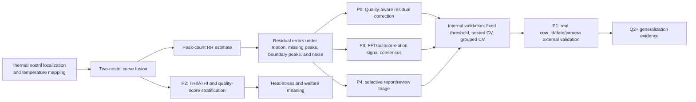

# Thermal RR Literature-Grounded Innovation Matrix

Updated: 2026-07-06

This document connects the local respiratory-rate literature folder, the current online PLF literature scan, and the existing `yoloV8` outputs into a concrete innovation plan. Its purpose is to keep the paper claim evidence-matched: improve respiratory-rate precision where the current data can support it, and add physiological and validation meaning where Q2-or-higher reviewers are likely to challenge the work.

Structured literature evidence is now generated by `scripts/build_rr_literature_gap_table.py`. The paper-ready outputs are `Dataset_new\72video\al_images\paper_repro_quality_residual_paper_assets\paper_literature_gap_table.csv`, `Dataset_new\72video\al_images\paper_repro_quality_residual_paper_assets\paper_literature_gap_table.md`, `Dataset_new\72video\al_images\paper_repro_quality_residual_paper_assets\paper_literature_innovation_priority.csv`, and `Dataset_new\72video\al_images\paper_repro_quality_residual_paper_assets\paper_literature_innovation_priority.md`; rerun the script before refreshing `paper_assets_summary.md` if sources or innovation claims change. Local PDF evidence from `E:\real\学习\呼吸文献` and `E:\real\可能结合文献` is separately normalized by `scripts/build_rr_local_literature_evidence_matrix.py` into `paper_literature_local_evidence_matrix.csv` and `paper_literature_local_evidence_matrix.md`, which now includes the `split_all_use` external-batch scoring blockers.

The innovation priority table is the current decision layer for manuscript use: P0 is the internal main algorithm contribution, P1/P2 are Q2-or-higher submission gates, P3/P4 are supplementary precision/deployment analyses, P5/P6 are future-work directions, and truth-calibrated RR remains an oracle upper bound only.

## 1. Evidence Sources

Local PDFs reviewed from `E:\real\学习\呼吸文献` and `E:\real\可能结合文献`:

| Local source | Main method or finding | Gap relevant to this project |
| --- | --- | --- |
| `agriculture-13-01939-v2.pdf` | Infrared thermography plus YOLOv8 nose detection, nostril segmentation, nostril temperature curve extraction, and sliding-window peak detection. Reported RR accuracy 94.58% and correlation coefficient R = 0.95 on 81 infrared videos. | Strong reference for the baseline technical route, but nostril segmentation and fixed peak detection still leave room for curve-quality and motion-aware correction. |
| `1-s2.0-S0306456525001111-main.pdf` | Low-resolution thermal RR under head movement. Uses YOLOv8n-Pose nostril keypoints, random-forest RGB-to-temperature mapping, and two-nostril curve fusion. Reported R2 = 0.92, RMSE = 3.53 bpm, and average RR detection accuracy 96.3% on 246 thermal videos. | Directly motivates the current reproduction. The remaining novelty should not repeat YOLO/keypoint mapping; it should address residual peak errors, quality scoring, and validation under motion. |
| `1-s2.0-S0022030224010300-main.pdf` | End-to-end RGB VideoMAE RR prediction using respiratory-belt ground truth. Reported MAE = 2.58 bpm, RMSE = 3.52 bpm, and Pearson r = 0.86 from 6 dairy cows. | Supports an end-to-end future direction, but the current dataset is too small and thermal-curve oriented for a strong transformer claim without more data. |
| `1-s2.0-S1537511024000163-main.pdf` | Compares 20 ML algorithms for RR prediction from production/environment variables; CatBoost with environmental variables performed best, with R2 = 0.676, MAE = 7.246, and SHAP highlighting air temperature, black-globe temperature, and airflow speed. | Supports adding environmental metadata and interpretability, but environmental ML alone is less precise than direct thermal/video RR. |
| `1-s2.0-S2666910223001217-main.pdf` | Training-free FFT image-analysis method for unrestrained lying cows using RGB and IR night-vision images. | Supports using frequency-domain estimates as an auxiliary signal or sanity check against peak-count errors. |
| `基于超参数优化算法的随机森林模型预测奶牛呼吸频率.pdf` | BO-RF model using ATHI, time region, milk yield, days in milk, posture, and parity. ATHI was the dominant feature in the reported feature-importance analysis. | Strong justification for collecting THI/ATHI and cow-level production metadata if the paper targets heat-stress or dairy-science venues. |
| `奶牛呼吸频率自动监测技术研究进展.pdf` | Review of dairy-cow RR automatic monitoring technology. | Useful for the Introduction to frame contact and non-contact methods, but not sufficient as the main novelty source. |

Recent online scan:

| Online source | Relevant point | Implication for this paper |
| --- | --- | --- |
| Public Computer Vision Datasets for Precision Livestock Farming: A Systematic Survey, arXiv 2024, https://arxiv.org/abs/2406.10628 | Identifies limited high-quality annotated datasets, diverse environments, and contextual metadata as bottlenecks in PLF CV research. | Directly supports the current metadata/external-validation protocol and explains why Q2 readiness cannot be claimed from internal curves alone. |
| Vision transformer-based multi-camera multi-object tracking framework for dairy cow monitoring, arXiv 2025, https://arxiv.org/abs/2508.01752 | Uses multi-camera alignment, segmentation, motion-aware memory, and tracking under occlusion/posture variation. | Long-term direction: robust identity/scene tracking can improve thermal RR deployment, but it is too large for the current 73-video paper unless new video data are added. |
| Holstein-Friesian Re-Identification using Multiple Cameras and Self-Supervision on a Working Farm, arXiv 2024/2025, https://arxiv.org/abs/2410.12695 | Demonstrates farm-scale cow re-identification and self-supervised identity learning from multi-camera data. | Supports real `cow_id` grouping and future semi-automatic identity assignment; not a substitute for manually filling current `cow_id` metadata. |
| Evaluating transfer learning strategies for improving dairy cattle body weight prediction in small farms, arXiv 2026, https://arxiv.org/abs/2601.01044 | Shows transfer learning can improve small-farm prediction when datasets are limited and farms differ. | Useful future direction if additional thermal/RGB RR data are collected across farms or sessions. |
| Video-based automatic lameness detection of dairy cows using pose estimation and multiple locomotion traits, arXiv/Computers and Electronics in Agriculture 2024, https://arxiv.org/abs/2401.05202 | Uses pose trajectories and multiple derived traits; multiple traits improved classification over a single trait. | Supports the current choice to use curve-quality, peak-spacing, endpoint, and spectral traits instead of only one peak-count threshold. |

## 2. Literature-Derived Research Gap

The baseline thermal RR literature has largely converged on three steps: locate the nostril or flank region, extract a temperature or motion signal, and estimate respiratory rate by peak counting or frequency analysis. The strongest head-movement thermal study already covers low-resolution nostril keypoint localization, random-forest color-to-temperature mapping, and two-nostril fusion. Repeating those components is not enough for a Q2+ contribution.

The clearest gap is after signal extraction: how to decide whether a detected peak sequence is trustworthy under head movement, missing nostril localization, boundary truncation, shallow peaks, and short-window noise. The current codebase already moves into this gap with quality-aware residual correction. This is the right main innovation because it improves the existing thermal-curve pipeline without using truth-calibrated per-video overrides.

The second gap is biological and deployment meaning. Environmental and production-variable studies show that RR is not only a signal-processing target; it is a heat-stress and welfare indicator. Therefore, a Q2+ paper needs THI/ATHI, quality strata, cow-level grouping, and external/holdout validation. Without these fields, the method can be described as internally validated, but not as broadly deployable.

## 3. Innovation Priority Matrix

| Priority | Innovation point | Current status | Expected value | Risk | Paper role |
| --- | --- | --- | --- | --- | --- |
| P0 | Quality-aware residual peak-count correction using curve quality, peak-count context, endpoint gaps, prominence, and spectral consistency | Implemented and validated internally | Best current precision gain: fixed-threshold out-of-fold RR R2 improves from 0.928992 to 0.942885; exact count improves from 49/73 to 53/73 | Bootstrap delta RR R2 CI still crosses zero; needs larger/external evidence | Main algorithm innovation |
| P1 | Metadata-grounded validation: real `cow_id`, date/session, camera/scene, motion, occlusion, nostril visibility, and external split | Protocol and annotation sheet exist; values missing | Converts internal validation into Q2-ready evidence and supports animal-level/generalization claims | Requires manual annotation or new collection | Submission gate |
| P2 | Heat-stress context: THI/ATHI plus RR-performance stratification | Scripts and readiness tables exist; temperature/humidity values missing | Gives the work biological meaning beyond computer-vision accuracy | Cannot be fabricated; needs real environment metadata | Methods/Discussion and journal fit |
| P3 | Signal-consensus estimator: peak count plus FFT/autocorrelation/spectral count estimate with a conservative quality gate | Implemented in `scripts/rr_signal_consensus_validation.py`; fixed OOF R2 = 0.946345, nested CV R2 = 0.940796, prefix-group fixed R2 = 0.936263 | Reduces additional +/-1 peak errors without new labels and supports the FFT literature link | Still internal; group train-selected result does not improve beyond the existing residual corrector | Candidate precision extension |
| P4 | Selective RR reporting: automatic-report versus manual-review triage from signal agreement, residual margin, interval stability, and missingness | Implemented in `scripts/rr_selective_prediction_validation.py`; strict automatic subset n = 13/73 with exact count = 13/13 and RR R2 = 0.999907 | Adds deployment meaning by showing when the system should output automatically or request review | Low coverage and internal thresholding; must be frozen on training data and externally tested | Deployment/uncertainty supplement |
| P5 | End-to-end RGB/thermal video model or transformer fusion | Not implemented | Potentially strong if a larger labeled video dataset is collected | Too data-hungry for the current 73-video curve dataset | Future work, not main claim |
| P6 | Multi-camera cow identity and motion-aware tracking | Not implemented | Strong deployment story for farms with multiple cameras | Requires new multi-camera data and identity labels | Future extension |

## 4. Recommended Innovation Route For This Repository

The current paper should be framed around P0 plus P1/P2 readiness. This route is defensible because it is already supported by code, tables, figures, and internal validation outputs. The manuscript should claim improved internal validation performance, not solved generalization. The recommended main contribution wording is:

> We propose a quality-aware residual peak-count correction framework for thermal-video respiratory-rate estimation in dairy cows. The framework uses curve quality, peak-spacing stability, endpoint ambiguity, prominence, and spectral consistency features to reduce residual breath-count errors after nostril temperature extraction, and it is evaluated with nested and grouped internal validation while preserving truth-assisted calibration as an upper-bound diagnostic only.

The P3 precision-focused code experiment has been implemented. The conservative implementation compares the default peak count, the existing residual-corrected count, the curve's spectral count estimate, and autocorrelation/FFT-derived counts. It preserves existing residual corrections and only adds a supplemental correction when at least two independent signal estimates agree with the residual-model direction and the peak train is not overly regular. This design follows the FFT literature without discarding the proven peak-based thermal RR route.

The P4 deployment-triage experiment has also been implemented. It does not change the RR estimate; it converts non-truth quality signals into automatic-report and manual-review decisions. This gives the paper a practical PLF operating mode while keeping the evidence boundary clear: the current strict subset is internally promising, but it is not yet a prospective reliability guarantee.

## 5. What Not To Claim

Do not claim that `truth-calibrated RR R2 = 0.999655` is the method performance. It is an upper-bound analysis because it uses reference information to select better per-video parameters.

Do not claim animal-level generalization from leave-one-prefix-group-out validation. Prefix groups are useful stress tests, but they are not verified `cow_id`, date, scene, or camera groups.

Do not claim heat-stress monitoring until `ambient_temperature_c`, `relative_humidity_percent`, and THI/ATHI fields are filled and analyzed. Environmental-RR papers make this a valuable direction, but they also raise the standard for metadata completeness.

Do not switch the main paper to a transformer/end-to-end model unless a larger, properly grouped dataset is collected. The RGB VideoMAE paper supports the future direction, but the current dataset is better suited to interpretable thermal-curve correction.

## 6. Conceptual Map

## 7. Immediate Actionable Experiments

The no-new-data signal-consensus validator is now implemented and produces `paper_repro_signal_consensus_metrics.csv`, `paper_repro_signal_consensus_predictions.csv`, nested/group metrics, and `paper_repro_signal_consensus_comparison_summary.csv`. The current result improves fixed out-of-fold and nested CV estimates and preserves the train-selected prefix-group result, so it can be reported as a candidate precision extension. It should still be treated as internal evidence until true metadata GroupKFold and external validation are available.

The selective RR validator is now implemented and produces `paper_repro_selective_rr_predictions.csv`, `paper_repro_selective_rr_metrics.csv`, `paper_repro_selective_rr_threshold_grid.csv`, and `paper_repro_selective_rr_summary.md`. It should be reported as uncertainty-aware review prioritization, with coverage reported beside accuracy.

The next manuscript-meaning experiment is to fill the metadata sheet and rerun the external-validation protocol. This does not require new model code, but it is the stronger determinant of Q2+ readiness than another internal tuning run.

## 8. Link To Existing Artifacts

Current main results are in `Dataset_new\72video\al_images\paper_repro_quality_residual_paper_assets\paper_main_results_table.csv`.

The external-validation and metadata protocol is `docs\thermal_rr_external_validation_protocol.md`.

The manuscript draft is `docs\thermal_rr_manuscript_draft.md`.

The submission strategy is `docs\thermal_rr_submission_strategy.md`.
